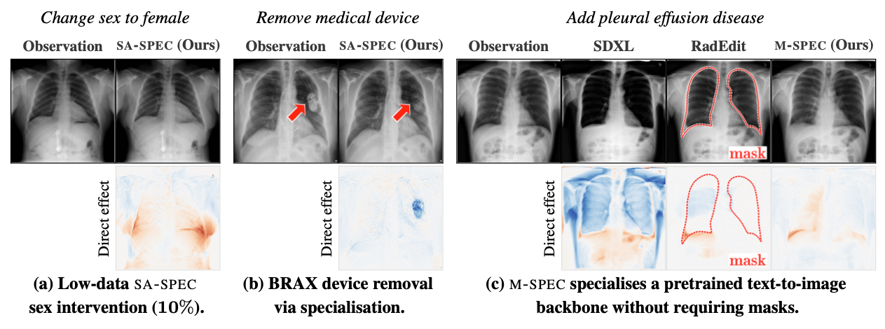
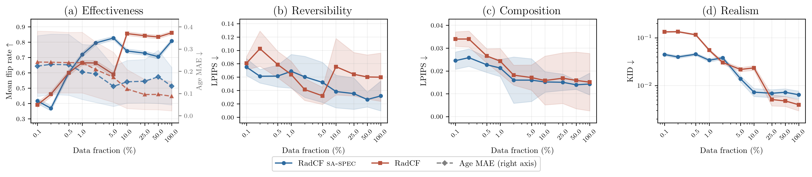
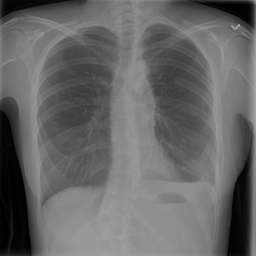
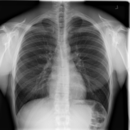
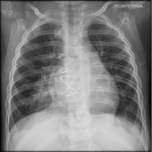

<!-- ============================================================ -->
<!-- 1. Title / pitch                                             -->
<!-- ============================================================ -->

<h1 align="center">Specialising Foundation Image Models<br>into Counterfactual Mechanisms</h1>

<p align="center">
  <b>RadCF: data- and parameter-efficient counterfactual image generation under domain shift</b>
</p>

<p align="center">
  Pretrained image generators provide strong image priors, but they are not
  directly usable as counterfactual mechanisms. We introduce
  <b>specialisation</b>: a mismatch-to-adaptation framework that converts
  pretrained generators into observation-specific counterfactual mechanisms
  by adapting only the components required by the target task.
</p>

<p align="center">
  <a href="#citation"></a>
  <a href="#installation"></a>
  <a href="LICENSE"></a>
</p>

---

<!-- ============================================================ -->
<!-- 2. Links                                                     -->
<!-- ============================================================ -->

<p align="center">
  <a href="#citation"><b>Paper</b></a> &ensp;|&ensp;
  <a href="#interactive-demo"><b>Interactive Demo</b></a> &ensp;|&ensp;
  <a href="#why-specialisation"><b>Method</b></a> &ensp;|&ensp;
  <a href="#installation"><b>Code</b></a>
</p>

---

<!-- ============================================================ -->
<!-- 3. Teaser figure                                             -->
<!-- ============================================================ -->

<p align="center">
  
</p>

---

<!-- ============================================================ -->
<!-- 6. Highlights                                                -->
<!-- ============================================================ -->

## Highlights

| | |
|---|---|
| **24M vs. 766M** | LoRA parameters used for specialisation versus training the flow mechanism from scratch |
| **5% target data** | S-SPEC reaches 0.993 view effectiveness, versus 0.684 when trained from scratch |
| **Domain-shift aware** | SA-SPEC adapts the image representation when the source VAE distorts target-domain anatomy |
| **Backbone-general** | M-SPEC extends structured counterfactual control to pretrained text-conditioned diffusion |
| **Downstream utility** | Paired counterfactuals expose and reduce view-based shortcut learning |

<p align="center">
  
</p>

---

<!-- ============================================================ -->
<!-- 7. Why specialisation?                                       -->
<!-- ============================================================ -->

## Why specialisation?

Existing counterfactual image generators are usually trained from scratch for
each target dataset. This is difficult in medical imaging, where labelled data
are limited and source and target datasets differ in scanners, protocols,
populations, and label representations.

Pretrained generators offer strong image priors, but cannot be used directly
for counterfactual inference:

- they may not expose the target parent variables;
- their image representation may not match the target acquisition domain;
- text conditioning may provide only an indirect and ambiguous proxy for the
  variables to be intervened on.

Specialisation identifies the mismatch and adapts the corresponding model
component, while retaining the reusable knowledge learned during pretraining.

---

<!-- ============================================================ -->
<!-- 8. Interactive-demo CTA                                      -->
<!-- ============================================================ -->

<h2 id="interactive-demo">Try it yourself</h2>

<!-- TODO: Add Hugging Face Spaces / Gradio link when available -->

> **Coming soon** &mdash; an interactive Gradio demo where you can upload a chest X-ray, select an intervention, and generate counterfactuals in real time.

---

<!-- ============================================================ -->
<!-- 9. Installation / Inference                                  -->
<!-- ============================================================ -->

<h2 id="installation">Installation</h2>

```bash
pip install torch torchvision
pip install accelerate transformers diffusers peft
pip install omegaconf timm lpips
pip install torchmetrics torchxrayvision scikit-learn  # for evaluation
pip install tensorboard wandb                          # optional logging
```

### Counterfactual inference

Generate counterfactual X-rays by intervening on metadata attributes:

```bash
python radcf/scripts/run_inference.py \
    --dataset chex8 \
    --mode lora \
    --base-model e2ev2_mixview \
    --save-dir ./output \
    --exp-name my_experiment \
    --finetune-steps 30000 \
    --ode-steps 200 \
    --flip-keys View \
    --save-originals
```

#### Intervention types

| Flag | Description | Example |
|------|-------------|---------|
| `--flip-keys` | Flip categorical attributes (comma-separated) | `--flip-keys View,Sex` |
| `--fixed-deltas` | Shift continuous attributes | `--fixed-deltas Age:0.2` |
| `--random-deltas` | Random continuous shift | `--random-deltas Age:-0.1:0.1` |
| `--fixed-classes` | Set categorical to specific class | `--fixed-classes Sex:1` |

### Training

```bash
# Train from scratch (SiT-XL + REPA-E)
accelerate launch radcf/scripts/run_train.py \
    --dataset chexpert --label-type custom --save-dir ./output \
    vae_update.enabled=true

# Fine-tune with LoRA (S-SPEC)
accelerate launch radcf/scripts/run_finetune.py \
    --mode lora --dataset chex8 --base-model e2ev2_mixview --save-dir ./output

# Fine-tune with LoRA + VAE co-training (SA-SPEC)
accelerate launch radcf/scripts/run_finetune.py \
    --mode lora --dataset chex8 --base-model e2ev2_mixview --save-dir ./output \
    vae_update.enabled=true

# Full-parameter fine-tuning
accelerate launch radcf/scripts/run_finetune.py \
    --mode full --dataset chex8 --base-model e2ev2_mixview --save-dir ./output
```

### Evaluation

The evaluation suite measures counterfactual quality across five dimensions
(effectiveness, composition, realism, minimality, reversibility) using trained
attribute judges, producing ~300 metrics per intervention.

```bash
# Step 1: Train attribute judges
python eval/scripts/train_judges.py --dataset chex8_effusion --train all

# Step 2: Evaluate counterfactuals
python eval/scripts/eval_pipeline.py \
    --cig_path ./results/chex8/lora/my_experiment/ode_200/ckpt_30000 \
    --test_dataset chex8_effusion \
    --intervention all
```

---

<!-- ============================================================ -->
<!-- 10. Dataset and model availability                           -->
<!-- ============================================================ -->

## Dataset and model availability

### Datasets

| Dataset | Source | Attributes |
|---------|--------|------------|
| **ChestX-ray8** (NIH14) | [NIH Clinical Center](https://nihcc.app.box.com/v/ChestXray-NIHCC) | Sex, Age, View, Effusion |
| **CheXpert** | [Stanford ML Group](https://stanfordmlgroup.github.io/competitions/chexpert/) | Sex, Age, View, Pleural Effusion |
| **BRAX** | [PhysioNet](https://physionet.org/content/brax/) | Sex, Age, View, Device, Pleural Effusion |

### Pretrained models

This release includes two implementations:

- **`radcf/`** — RadCF, the latent-flow instantiation of specialisation (S-SPEC, SA-SPEC). Base models are registered in `radcf/configs/model_zoo.py`.
- **`RadEdit/`** — M-SPEC: LoRA metadata conditioning applied to [RADEdit](https://huggingface.co/microsoft/radedit) (text-conditioned diffusion backbone).

| Model | Description |
|-------|-------------|
| `e2ev2_mixview` | SiT-XL v2 on CheXpert (mixed views, recommended) |
| `e2e_mixview` | SiT-XL end-to-end on CheXpert (mixed views) |
| `e2e_frontal` | SiT-XL end-to-end on CheXpert (frontal only) |
| `noe2e_mixview` | SiT-XL flow-matching only (mixed views) |
| `sit-xl-natural-image` | SiT-XL pretrained on natural images |

---

<!-- ============================================================ -->
<!-- 11. Citation                                                 -->
<!-- ============================================================ -->

## Citation

If you use this work in your research, please cite:

```bibtex
@article{radcf,
    title={Specialising Foundation Image Models into Counterfactual Mechanisms},
    year={2026}
}
```

---

<!-- ============================================================ -->
<!-- Visual examples                                              -->
<!-- ============================================================ -->

## Visual examples

<p align="center">
  
  &nbsp;&nbsp;
  
  &nbsp;&nbsp;
  
</p>

<p align="center">
  <code>do(Sex=F)</code> &emsp; <code>do(Effusion=1)</code> &emsp; <code>do(Device=0)</code>
</p>

---

<!-- ============================================================ -->
<!-- Responsible-use statement                                    -->
<!-- ============================================================ -->

## Responsible use

This is a **research tool** designed to advance understanding of counterfactual reasoning in medical imaging. Please observe the following:

- **Not for clinical diagnosis.** Counterfactual images are synthetic and must not be used to make or influence clinical decisions.
- **Dataset biases.** The underlying datasets carry demographic and label biases inherent to their collection. Counterfactuals generated from biased data may reflect or amplify those biases.
- **Fairness auditing, not fairness washing.** Specialisation can help *reveal* how models respond to protected attributes, but generating counterfactuals does not by itself make a model fair. Interpret results carefully and in context.
- **Synthetic-image disclosure.** Any generated images shared externally should be clearly labelled as synthetic / AI-generated.
- **Ethical review.** Use of this tool on patient data should follow applicable institutional review board (IRB) or ethics committee guidelines.
- **Dual-use awareness.** Realistic medical image synthesis could be misused. Users are responsible for ensuring their use aligns with applicable laws and ethical standards.

See [LICENSE](LICENSE) for terms of use.
